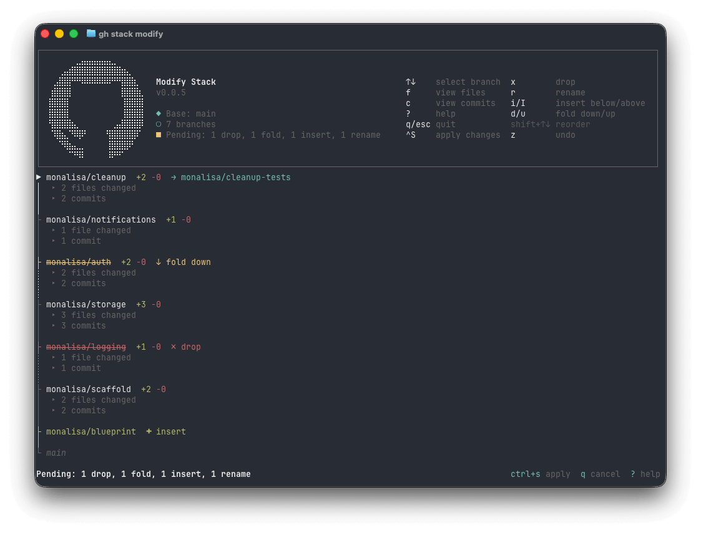

`gh stack modify` provides an interactive terminal UI for restructuring a stack locally. You can drop, fold, insert, rename, and reorder branches and then apply all your changes at once.



## When to use modify

Use `modify` when you need to:
- **Remove** a branch from the stack
- **Combine** two branches into one
- **Insert** a new branch into the stack
- **Rename** a branch
- **Reorder** branches

## Prerequisites

Before running `modify`, ensure:
- You have an active stack checked out locally
- Your working tree is clean (no uncommitted changes)
- No rebase is in progress
- No PR in the stack is queued for merge
- Commit history is linear (run `gh stack rebase` first if needed)

## Opening the TUI

```sh
gh stack modify
```

The TUI shows your stack as a vertical list of branches with PR information, commits, and files changed. Merged branches appear as locked rows that cannot be modified. Press `?` for a help overlay describing all operations.

## Operations

### Drop (`x`)

Removes a branch and its commits from the stack. The local branch and any associated PR are preserved. Upstream branches are rebased to exclude the dropped branch's unique commits.

### Fold down (`d`)

Absorbs the selected branch's commits into the branch below it (toward trunk) via cherry-pick. The folded branch is removed from the stack.

### Fold up (`u`)

Absorbs the selected branch's commits into the branch above it (away from trunk). Since the branch above already contains the folded branch's commits in its history, this is handled by adjusting what is considered the first unique commit for the branch. The folded branch is removed from the stack.

### Insert below / above (`i` / `I`)

Inserts a new empty branch into the stack at the cursor position. Lowercase `i` inserts below the cursor (toward trunk); uppercase `I` inserts above the cursor (away from trunk). An inline prompt appears to enter the new branch name. The branch is created at apply time, pointing at the parent branch's tip.

### Rename (`r`)

Opens an inline prompt to enter a new name for the branch. The branch is renamed locally and in the stack metadata. On the next `submit`, the new branch name is pushed to GitHub.

### Reorder (`Shift+↑`/`Shift+↓`)

Moves the selected branch up (away from trunk) or down (toward trunk) in the stack. A cascading rebase adjusts all affected branches. Note: reordering and structural changes (drop/fold/insert/rename) cannot be mixed in the same session.

### Undo (`z`)

Reverses the most recent staged action. You can undo multiple times to step back through your changes.

## Applying changes

Press `Ctrl+S` to apply all staged changes. Nothing is modified until you save. The apply phase renames branches, inserts new branches, folds/drops branches, and runs a cascading rebase to create a linear commit history with the desired stack state.

### Handling conflicts

If a rebase conflict occurs during the apply phase, you have two options:

1. **Resolve and continue**: Fix the conflicts in your editor, stage with `git add`, then run `gh stack modify --continue` (you may need to do this multiple times)
2. **Abort**: Run `gh stack modify --abort` to abort the operation and restore the stack to the pre-modify state

If a second conflict occurs after continuing, the same options are available.

## After modifying

If a stack of PRs has been created on GitHub, run:

```sh
gh stack submit
```

This pushes the updated branches and recreates the stack. The old stack is automatically replaced.

## Aborting

If you want to discard all changes and restore the stack to its pre-modify state, run:

```sh
gh stack modify --abort
```

This also works if `modify` was interrupted (e.g., terminal crash). A pre-modify snapshot is cached locally for state recovery.

## Limitations

- Cannot modify merged branches (they are locked)
- Cannot split a branch into multiple branches
- Cannot move branches between different stacks
- Requires an interactive terminal
- Reordering and structural changes (drop/fold/insert/rename) cannot be mixed in the same session
